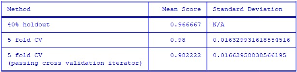

# iris-classification-cv
Using database of iris flowers, creates model to predict species of iris using cross validation.

### DEC2022

## The Dataset

#### A database of iris characteristcs was downloaded from the link below. The dataset contains length and width measurements of the petals and sepals from three species of irises.

https://archive.ics.uci.edu/ml/datasets/iris

## Classification using Scikit-learn

#### Following the below example from the scikit-learn website, I was able to try a simple example of using cross validation.

https://scikit-learn.org/stable/modules/cross_validation.html

#### From this example, I was able to learn the advantages of using cross validation. Cross validation, in general, can help to improve the accuracy of the model by allowing you to use multiple subsets of the data. This helps to avoid overfitting as the evaluation metrics of the test set are often used to determine how the set is trained. 

#### Support vector classification was used in this example, where the model was used with a 40% hold out, and with cross validation in two different methods. The results can be seen in the below table. 

